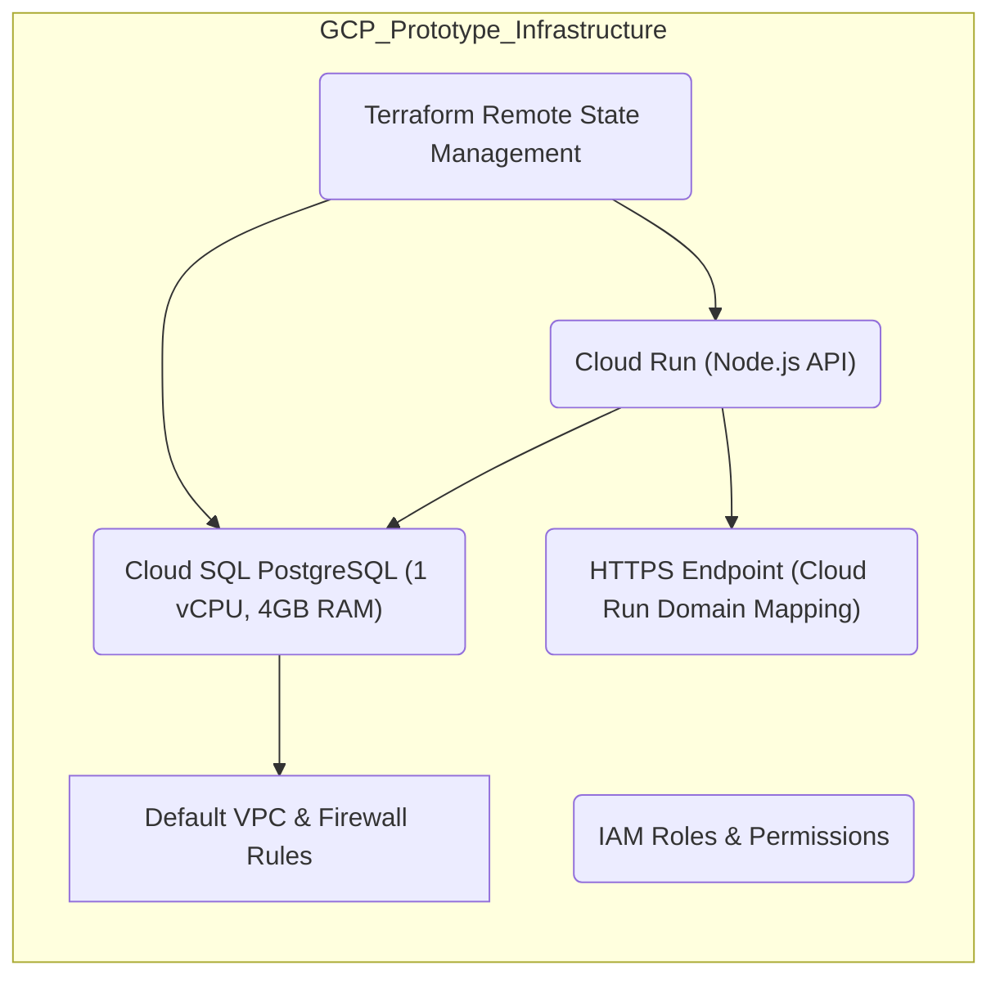

# GCP Node.js API with Cloud Run and Cloud SQL

This project was generated by cloudgo.ai

## Overview

This Terraform project deploys a cost-optimized prototype Node.js API on Google Cloud Platform (GCP) using Cloud Run and a managed PostgreSQL database on Cloud SQL.

The API is deployed as a serverless Cloud Run service with fixed scaling (1 instance) to minimize cost and operational overhead. The backend database is a small Cloud SQL PostgreSQL instance with public IP access for simplicity.

Basic networking uses the default VPC and a firewall rule to allow HTTPS ingress.

## Architecture Diagram



## Requirements

- Terraform 1.3.0 or newer
- Google Cloud SDK configured with appropriate permissions
- A GCP project with billing enabled

## Usage

1. Set required variables in a `terraform.tfvars` file or via environment variables:

```hcl
project_id = "your-gcp-project-id"
cloud_run_image = "gcr.io/your-project/nodejs-api:latest"
db_password = "your-secure-db-password"
custom_domain = "" # Optional, set if you want to use a custom domain
```

2. Initialize Terraform:

```bash
terraform init
```

3. Review the plan:

```bash
terraform plan
```

4. Apply the configuration:

```bash
terraform apply
```

5. Outputs will include the Cloud Run service URL and Cloud SQL instance details.

## Notes

- The Cloud Run service is configured with fixed scaling (1 instance) to disable autoscaling.
- The Cloud SQL instance is publicly accessible; restrict authorized networks as needed for security.
- The optional Cloud Run domain mapping resource is commented out; enable and configure if you have a custom domain.

## License

This project is provided as-is without warranty.
